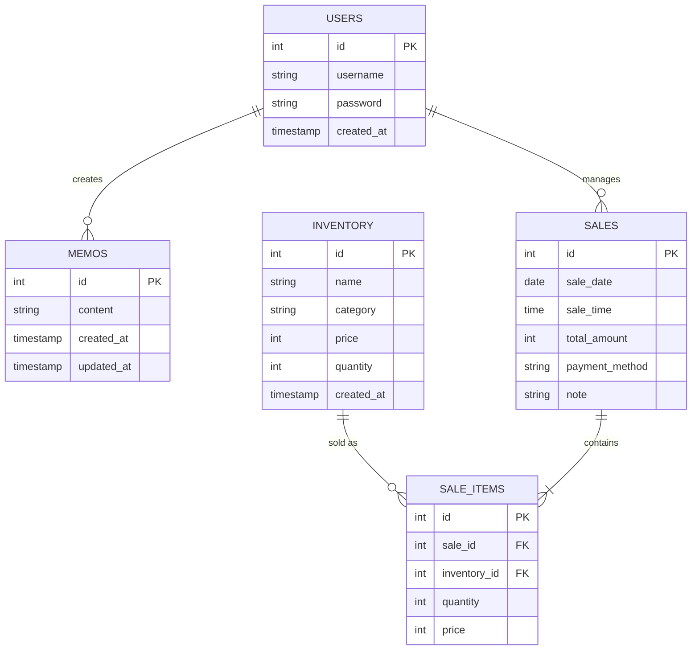
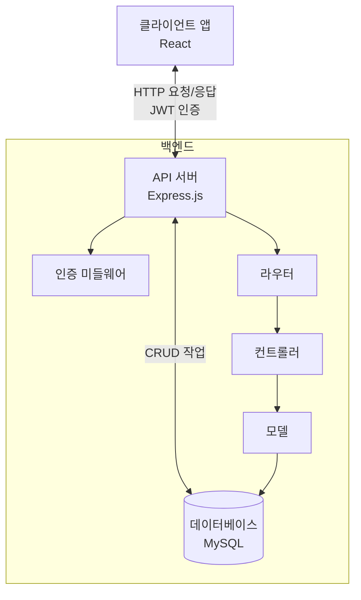

# RODEO 전자담배 판매관리 시스템 - 백엔드

전자담배 판매점의 재고, 판매, 메모 관리를 위한 백엔드 API 서버입니다.

## 목차
- [기술 스택](#기술-스택)
- [프로젝트 구조](#프로젝트-구조)
- [데이터베이스 스키마](#데이터베이스-스키마)
- [백엔드 아키텍처](#백엔드-아키텍처)
- [API 문서](#api-문서)
- [주요 기능](#주요-기능)

## 기술 스택

- **런타임**: Node.js
- **프레임워크**: Express.js
- **데이터베이스**: MySQL
- **인증**: JWT (JSON Web Token)
- **기타 라이브러리**:
  - bcrypt: 비밀번호 암호화
  - dotenv: 환경변수 관리
  - cors: CORS 정책 처리
  - mysql2: MySQL 연결 및 쿼리

## 프로젝트 구조

## 데이터베이스 스키마

### 테이블 구조

#### 1. users 테이블
| 필드     | 타입         | 설명                 | 제약조건       |
|---------|-------------|---------------------|--------------|
| id      | INT         | 사용자 ID            | PK, AUTO_INC |
| username| VARCHAR(50) | 사용자명             | UNIQUE, NOT NULL |
| password| VARCHAR(255)| 암호화된 비밀번호     | NOT NULL     |
| created_at | TIMESTAMP | 계정 생성 일시       | DEFAULT CURRENT_TIMESTAMP |

#### 2. inventory 테이블
| 필드     | 타입         | 설명                 | 제약조건       |
|---------|-------------|---------------------|--------------|
| id      | INT         | 상품 ID              | PK, AUTO_INC |
| name    | VARCHAR(100)| 상품명               | NOT NULL     |
| category| VARCHAR(50) | 카테고리             | NOT NULL     |
| price   | INT         | 판매 가격             | NOT NULL     |
| quantity| INT         | 재고 수량             | NOT NULL, DEFAULT 0 |
| created_at | TIMESTAMP | 등록 일시            | DEFAULT CURRENT_TIMESTAMP |

#### 3. sales 테이블
| 필드     | 타입         | 설명                 | 제약조건       |
|---------|-------------|---------------------|--------------|
| id      | INT         | 판매 ID              | PK, AUTO_INC |
| sale_date | DATE      | 판매 날짜             | NOT NULL     |
| sale_time | TIME      | 판매 시간             | NOT NULL     |
| total_amount | INT    | 총 판매액            | NOT NULL     |
| payment_method | VARCHAR(20) | 결제 방식    | NOT NULL     |
| note    | TEXT        | 메모                 |              |

#### 4. sale_items 테이블
| 필드     | 타입         | 설명                 | 제약조건       |
|---------|-------------|---------------------|--------------|
| id      | INT         | 항목 ID              | PK, AUTO_INC |
| sale_id | INT         | 판매 ID              | FK(sales.id), NOT NULL |
| inventory_id | INT    | 상품 ID              | FK(inventory.id), NOT NULL |
| quantity| INT         | 판매 수량             | NOT NULL     |
| price   | INT         | 판매 당시 가격         | NOT NULL     |

#### 5. memos 테이블
| 필드     | 타입         | 설명                 | 제약조건       |
|---------|-------------|---------------------|--------------|
| id      | INT         | 메모 ID              | PK, AUTO_INC |
| content | TEXT        | 메모 내용             | NOT NULL     |
| created_at | TIMESTAMP | 작성 일시            | DEFAULT CURRENT_TIMESTAMP |
| updated_at | TIMESTAMP | 수정 일시            | DEFAULT CURRENT_TIMESTAMP ON UPDATE |

### ER 다이어그램

## 백엔드 아키텍처

#### 전체 시스템 아키텍처

sequenceDiagram
    participant C as 클라이언트
    participant R as 라우터
    participant M as 미들웨어
    participant Co as 컨트롤러
    participant Mo as 모델
    participant D as 데이터베이스
    
    C->>R: HTTP 요청
    R->>M: 요청 전달
    M->>M: 인증 및 권한 확인
    M->>Co: 검증된 요청
    Co->>Mo: 데이터 작업 요청
    Mo->>D: SQL 쿼리
    D-->>Mo: 쿼리 결과
    Mo-->>Co: 데이터 반환
    Co-->>C: HTTP 응답 (JSON)

    graph TD
    Server[Server.js] --> App[App.js]
    App --> Routes[라우트 모듈]
    App --> Middlewares[미들웨어]
    
    Routes --> AuthRoutes[인증 라우트]
    Routes --> InventoryRoutes[재고 라우트]
    Routes --> SalesRoutes[판매 라우트]
    Routes --> MemoRoutes[메모 라우트]
    Routes --> MonthlyRoutes[통계 라우트]
    
    AuthRoutes --> AuthController[인증 컨트롤러]
    InventoryRoutes --> InventoryController[재고 컨트롤러]
    SalesRoutes --> SalesController[판매 컨트롤러]
    MemoRoutes --> MemoController[메모 컨트롤러]
    MonthlyRoutes --> MonthlyController[통계 컨트롤러]
    
    AuthController --> UserModel[사용자 모델]
    InventoryController --> InventoryModel[재고 모델]
    SalesController --> SalesModel[판매 모델]
    MemoController --> MemoModel[메모 모델]
    MonthlyController --> SalesModel
    
    UserModel --> Database[(MySQL DB)]
    InventoryModel --> Database
    SalesModel --> Database
    MemoModel --> Database

## 아키텍처 설명

위 제안은 프로젝트 구조 섹션을 확장하여 다음 세 가지 아키텍처 다이어그램을 포함시켰습니다:

1. **전체 시스템 아키텍처**: 클라이언트, API 서버, 데이터베이스 사이의 관계와 주요 백엔드 구성 요소를 시각화합니다.

2. **요청 처리 흐름**: HTTP 요청이 프론트엔드에서 백엔드로 들어와 처리되고 응답이 반환되는 과정을 시간 순서로 보여줍니다.

3. **모듈 간 의존성**: 백엔드 모듈들이 어떻게 상호 연결되어 있는지 계층적으로 보여줍니다.

이러한 다이어그램은 코드의 구조와 흐름에 대한 시각적 이해를 제공하며, 개발자들이 프로젝트의 아키텍처를 빠르게 파악할 수 있도록 돕습니다. GitHub에서 Mermaid 문법이 자동으로 렌더링되므로 이 다이어그램들은 README에서 시각적으로 표시됩니다.## 아키텍처 설명

위 제안은 프로젝트 구조 섹션을 확장하여 다음 세 가지 아키텍처 다이어그램을 포함시켰습니다:

1. **전체 시스템 아키텍처**: 클라이언트, API 서버, 데이터베이스 사이의 관계와 주요 백엔드 구성 요소를 시각화합니다.

2. **요청 처리 흐름**: HTTP 요청이 프론트엔드에서 백엔드로 들어와 처리되고 응답이 반환되는 과정을 시간 순서로 보여줍니다.

3. **모듈 간 의존성**: 백엔드 모듈들이 어떻게 상호 연결되어 있는지 계층적으로 보여줍니다.

이러한 다이어그램은 코드의 구조와 흐름에 대한 시각적 이해를 제공하며, 개발자들이 프로젝트의 아키텍처를 빠르게 파악할 수 있도록 돕습니다. GitHub에서 Mermaid 문법이 자동으로 렌더링되므로 이 다이어그램들은 README에서 시각적으로 표시됩니다.
## API 문서

### 인증 관련
- `POST /api/auth/login` - 로그인
- `POST /api/auth/logout` - 로그아웃

### 재고 관리
- `GET /api/inventory` - 전체 재고 목록 조회
- `GET /api/inventory/low-stock` - 재고 부족 항목 조회
- `GET /api/inventory/category/:category` - 카테고리별 재고 조회
- `GET /api/inventory/search?term=검색어` - 상품 검색

### 재고 항목 관리 (관리자용)
- `POST /api/inventory-manage/item` - 신규 상품 등록
- `PUT /api/inventory-manage/item/:id` - 상품 정보 수정
- `DELETE /api/inventory-manage/item/:id` - 상품 삭제

### 판매 관리
- `GET /api/sales?date=YYYY-MM-DD` - 특정 날짜 판매 기록 조회
- `POST /api/sales` - 새로운 판매 기록 추가
- `PUT /api/sales/:id` - 판매 정보 수정
- `DELETE /api/sales/:id` - 판매 기록 삭제

### 월별 매출
- `GET /api/monthly` - 월별 매출 데이터 조회

### 메모 관리
- `GET /api/memos` - 모든 메모 조회
- `POST /api/memos` - 새 메모 추가
- `PUT /api/memos/:id` - 메모 수정
- `DELETE /api/memos/:id` - 메모 삭제

## 주요 기능

### 1. 인증 시스템
- JWT 기반 사용자 인증
- 로그인/로그아웃 관리
- 보호된 라우트에 미들웨어 적용
- 비밀번호 암호화 저장 (bcrypt 사용)

### 2. 재고 관리
- 카테고리별 재고 조회 및 필터링
- 재고 부족 알림 시스템
- 카테고리별 임계치 설정 (코일팟: 10개 이하, 기타: 5개 이하)
- 재고 검색 및 필터링
- 재고 등록/수정/삭제 기능

### 3. 판매 관리
- 일별 판매 기록 관리
- 판매 시 자동 재고 차감
- 결제 방법별 판매 내역 관리 (카드/현금/이체)
- 판매 기록 수정 및 삭제

### 4. 통계 및 보고서
- 월별 매출 집계 및 데이터 제공
- 최고 매출 월 정보 제공
- 연간 총매출 및 당월 매출 정보

### 5. 메모 시스템
- 중요 정보 기록을 위한 메모 기능
- 메모 작성, 수정, 삭제 기능
- 작성일 기준 정렬

